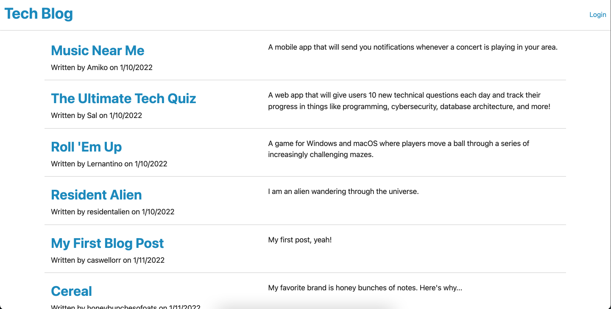

# 🏗️ Tech Blog

Link : https://vast-woodland-74466.herokuapp.com/

## Description 📖

Writing about tech can be just as important as making it. Developers spend plenty of time creating new applications and debugging existing codebases, but most developers also spend at least some of their time reading and writing about technical concepts, recent advancements, and new technologies.

The Tech Blog application is a CMS-style blog site similar to a Wordpress site, where developers can publish their blog posts and comment on other developers’ posts as well.

## Features 📝

The Tech Blog application follows the MVC paradigm in its architectural structure, using Handlebars.js as the templating language, Sequelize as the ORM, and the express-session npm package for authentication. 

## Screenshots 📷 :

* User is presented with a landing page where they can see recent posts:

  
  
* User presented with login or sign up page:

  

* User dashboard where they can create a new post or update an old one:

  

* User can leave a comment on someone else's post:

  
  

## Takeaways 💡

MVC kept me organized. I was able to seamlessly connect the front and back ends. This application was a great refresher of front end JavaScript and DOM traversal. I enjoyed pushing myself through this project. 

----
© 2021 Caswell Orr. Confidential and Proprietary. All Rights Reserved.